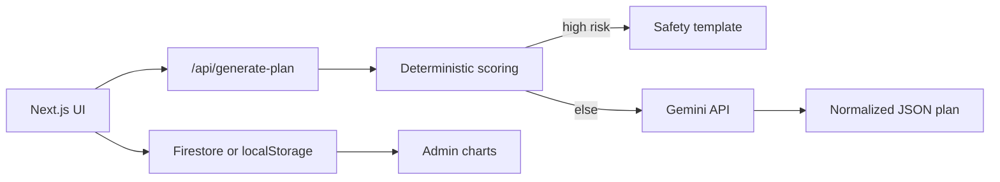

## CalmPath — Student Stress & Burnout First‑Aid (Solution Challenge 2026)

[](https://github.com/visshva-r/CalmPath-Student-Wellbeing/actions/workflows/ci.yml)

**CalmPath** is a 2–3 minute student wellbeing check-in: an **explainable severity score**, a **safety-gated Gemini 7-day plan**, and a follow-up checklist. It does not diagnose.

Live: https://calm-path-student-wellbeing.vercel.app/  
Case study: [`docs/CASE_STUDY.md`](docs/CASE_STUDY.md)

### Why it matters (SDG 3)
Exam weeks overload students. CalmPath is a short check-in and a next-week plan. Campuses get anonymized demand charts so support can be staffed where load is highest.

### Resume bullets
- End-to-end product: check-in wizard → explainable score (with reasons) → Gemini or **safety fallback** → 7-day checklist
- Safety-first AI: high-risk sessions **skip Gemini** and return a fixed escalation plan
- Privacy-first storage: anonymized history; notes opt-in; Firebase optional with localStorage fallback
- Campus admin: severity mix, peak hours/weekdays, CSV — no PII
- Production habits: Zod, rate limits, 24h cache, Vitest + Playwright, GitHub Actions

### Architecture



Full write-up: [`docs/ARCHITECTURE.md`](docs/ARCHITECTURE.md)

### Tech stack

| Area | Choice |
| --- | --- |
| App | Next.js 16 (App Router), TypeScript, Tailwind |
| AI | Google Gemini (`gemini-2.5-flash`) via `@google/generative-ai` |
| Validation | Zod (`CheckInSchema`, `PlanSchema`) |
| Auth / DB | Firebase Auth (anonymous + Google) + Firestore (optional) |
| Charts | Recharts |
| Hosting | Vercel (Next.js) + optional Firebase Auth/Firestore |
| Tests / CI | Vitest, Playwright, GitHub Actions |

### Demo flow
1. Landing → **Start check-in** → consent (**I understand, continue**)
2. Three steps: Rest & body → Stress & support → Safety & notes
3. Results: score meter + reasons + plan + checklist
4. **Safety demo:** on step 3, check “I feel unsafe…”. You should see **Safety fallback plan** (Gemini skipped)
5. Dashboard (history) and Campus (`/admin`) charts

### Google AI usage
- **Gemini API** via `@google/generative-ai` in `src/app/api/generate-plan/route.ts`
- Prompt versioned in `src/lib/prompts/calmPathPlan.ts` (`PROMPT_VERSION`)
- High-risk check-ins skip Gemini and return a fixed safety plan
- Plans are normalized (trim/dedupe) and identical check-ins are cached for 24h

## Run locally
1) Install deps

```bash
npm install
```

2) Add env vars

Copy `.env.local.example` → `.env.local` and set:
- `GEMINI_API_KEY=...` (from Google AI Studio)

Optional Firebase (cloud history + Google sign-in):
- `NEXT_PUBLIC_FIREBASE_API_KEY`
- `NEXT_PUBLIC_FIREBASE_AUTH_DOMAIN`
- `NEXT_PUBLIC_FIREBASE_PROJECT_ID`
- `NEXT_PUBLIC_FIREBASE_STORAGE_BUCKET`
- `NEXT_PUBLIC_FIREBASE_MESSAGING_SENDER_ID`
- `NEXT_PUBLIC_FIREBASE_APP_ID`
- `NEXT_PUBLIC_ADMIN_PIN` (optional; locks `/admin`)

3) Start

```bash
npm run dev
```

Open `http://localhost:3000`

## Tests

```bash
npm run test        # Vitest unit + API tests
npm run test:e2e    # Playwright (starts the app)
npm run lint
npm run build
```

CI runs lint, unit tests, production build, and Chromium E2E on every push to `main`.

## Firebase setup (optional but recommended)
1. Create a Firebase project and enable **Anonymous Auth** + **Google Auth**.
2. Create a Firestore database (production or test mode, then publish rules).
3. Copy web app config into `.env.local` (and Vercel env vars).
4. Publish `firestore.rules` from this repo:
   - `users/{uid}/checkins` — severity, score, timestamp; notes only if the user opted in
   - `users/{uid}/plans` — plan metadata (source + prompt version), not the full plan text
   - `users/{uid}/followups` — checklist completion
   - `publicCheckins` — anonymized campus aggregates (no uid, no notes)

Optional: set `NEXT_PUBLIC_ADMIN_PIN` to lock `/admin`.

Without Firebase env vars, the app still runs using sessionStorage + localStorage.

## Hosting (hybrid)

CalmPath stays on **Vercel** for the Next.js app and API routes. That is the production host — there is no migration to Firebase Hosting or Cloud Run.

**Firebase is optional Google Cloud**, used only when `NEXT_PUBLIC_FIREBASE_*` is set:

| Piece | Where it runs |
| --- | --- |
| UI + `/api/generate-plan` | Vercel |
| Gemini | Google AI Studio key (`GEMINI_API_KEY` on Vercel) |
| Auth (anonymous / Google) | Firebase Auth |
| Check-in summaries + `publicCheckins` | Firestore |
| Demo without a Firebase project | Browser `localStorage` / `sessionStorage` |

Publish `firestore.rules` from this repo if you enable Firebase. The app does not require GCP Hosting.

## Deploy (Vercel)
1) Push this repo to GitHub (public)  
2) Import to Vercel  
3) Add `GEMINI_API_KEY` (and Firebase `NEXT_PUBLIC_*` vars if used)  
4) Deploy

Live: https://calm-path-student-wellbeing.vercel.app/  
Repo: https://github.com/visshva-r/CalmPath-Student-Wellbeing

## Safety note
CalmPath is **not medical advice** and does **not** diagnose. If a user indicates they feel unsafe, the system prioritizes safety guidance and encourages contacting trusted help/emergency services.
