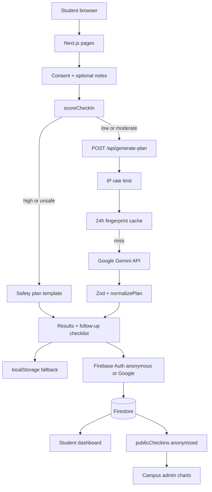

# CalmPath architecture

CalmPath is a Next.js App Router app. Students complete a short check-in; a **deterministic scorer** assigns low/moderate/high; **Gemini** (or a safety template) returns a structured 7-day plan. Anonymized summaries can persist in **Firestore** for student history and campus allocation views.

## Layers

| Layer | Responsibility |
| --- | --- |
| UI (`src/app/*`) | Check-in wizard, explainable results, dashboards, privacy, admin PIN gate |
| Domain (`src/lib/checkin.ts`) | Zod payload + explainable score |
| AI (`src/lib/prompts`, `src/app/api/generate-plan`) | Versioned prompt, retries, timeout, cache |
| Persistence (`src/lib/history.ts`, `src/lib/followUp.ts`) | Device storage and optional Firestore |
| Analytics (`src/lib/analytics.ts`) | Aggregates for allocation (severity, hours, weekdays) |

## Data (privacy)

- **Sent to Gemini:** current check-in sliders + optional notes. High-risk sessions skip the model.
- **Stored by default:** severity, score, timestamp, plan source. Notes only if the student opts in.
- **Never stored in `publicCheckins`:** uid, notes, or raw answers.
- **Server logs:** event, severity, score, prompt version — not notes.

## Hosting (hybrid — stay on Vercel)

CalmPath is **not** hosted on Firebase Hosting. Production is:

| Piece | Host |
| --- | --- |
| Next.js UI + Route Handlers | **Vercel** |
| Gemini | Google AI Studio (`GEMINI_API_KEY` as a Vercel secret) |
| Optional Auth | Firebase Auth (anonymous + Google) |
| Optional persistence | Firestore (`users/{uid}/…` and `publicCheckins`) |

Firebase env vars are optional. Without them, history and follow-ups stay on the device. Enabling Firebase does not require moving the app off Vercel.
